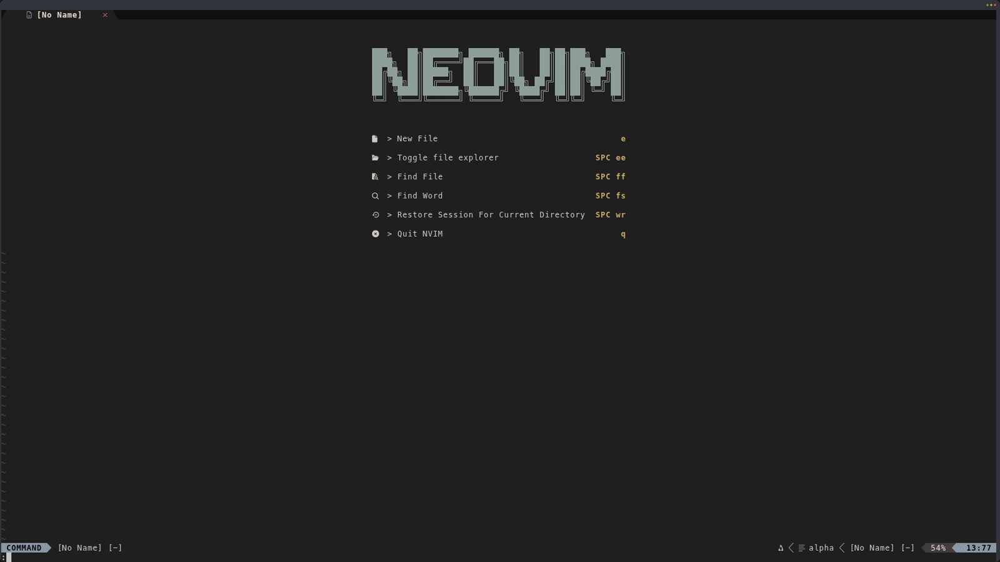

# agent-term.nvim

<p align="center">
  
</p>

<p align="center">
  <strong>Neovim bridge for terminal-based coding agents.</strong>
</p>

<p align="center">
  <code>agent-term.nvim</code> keeps persistent interactive terminal-agent sessions inside Neovim and lets you view the active agent as either a centered float or a left, right, or bottom panel.
</p>

<p align="center">
  Each configured agent gets its own persistent terminal session. Switching agents changes the active view without killing unrelated sessions.
</p>

<p align="center">
  <a href="#install">Install</a> ·
  <a href="#minimal-configuration">Config</a> ·
  <a href="#agent-presets">Agents</a> ·
  <a href="#context-behaviour">Context</a> ·
  <a href="#quick-reference">Quick Reference</a> ·
  <a href="#advanced-docs">Advanced Docs</a>
</p>

## At a Glance

<table>
  <tr>
    <td><strong>Per-agent sessions</strong><br />Keeps a persistent terminal process for each configured agent.</td>
    <td><strong>Two layouts</strong><br />Switch between float and panel without spawning a second terminal.</td>
    <td><strong>Lightweight context</strong><br />Send buffer, selection, and diagnostics metadata without dumping full contents.</td>
  </tr>
  <tr>
    <td><strong>Agent presets</strong><br />Start quickly with Codex, Gemini, Claude, Aider, Copilot, or Opencode.</td>
    <td><strong>Custom agents</strong><br />Run any compatible interactive terminal command.</td>
    <td><strong>Automatic resume</strong><br />Optionally start supported presets through a picker or last-session command.</td>
  </tr>
</table>

The default agent is Codex. Presets are best-effort defaults for common terminal agents; any compatible interactive command can be configured directly.

## Why agent-term.nvim?

Most Neovim AI plugins abstract agents behind a shared chat UI. `agent-term.nvim` takes the
opposite approach: it keeps each agent's real terminal interface inside Neovim.

That means Codex, Claude, Gemini, Aider, Copilot, OpenCode, and other terminal agents keep their
own slash commands, menus, model switching, permission flows, hooks, highlighting/autocomplete,
and session behavior when supported by the agent TUI.

The plugin adds a Neovim bridge around that native UI: persistent per-agent terminal sessions,
float/panel views, editor context capture, diagnostics/selection/buffer metadata, keymaps,
runtime agent switching, startup/kill helpers, and optional native hook installation.

## Requirements

- Neovim 0.12+
- A terminal coding agent installed and authenticated as needed

## Install

### lazy.nvim

The native float host has no UI dependency:

```lua
{
  "alsi-lawr/agent-term.nvim",
  main = "agent_term",
  keys = {
    { "<leader>co", "<cmd>AgentTermToggle<cr>", desc = "Agent terminal" },
    { "<leader>cp", "<cmd>AgentTermPanelToggle<cr>", desc = "Agent panel" },
    { "<leader>ck", "<cmd>AgentTermKill<cr>", desc = "Agent kill" },
    { "<leader>cb", "<cmd>AgentTermSendBufferContext<cr>", desc = "Agent buffer context" },
    { "<leader>cs", "<cmd>AgentTermSendSelectionContext<cr>", mode = { "n", "x" }, desc = "Agent selection context" },
  },
  opts = {},
}
```

To use the Snacks float host, declare Snacks explicitly and select it in `opts`:

```lua
{
  "alsi-lawr/agent-term.nvim",
  main = "agent_term",
  dependencies = {
    { "folke/snacks.nvim", opts = {} },
  },
  opts = {
    float = {
      host = "snacks",
    },
  },
}
```

The `keys` block in the native example is optional. Plugin-managed keymaps are disabled by default.

### vim.pack

Neovim 0.12's built-in package manager makes added plugins available before the next line runs. Add
Snacks before Agent Term, then configure both in the same order:

```lua
vim.pack.add({
  "https://github.com/folke/snacks.nvim",
  "https://github.com/alsi-lawr/agent-term.nvim",
})

require("snacks").setup({})
require("agent_term").setup({
  float = {
    host = "snacks",
  },
})
```

For the native host, omit the Snacks URL and setup call, and use `require("agent_term").setup({})`.

### vim-plug

Declare both plugins before `plug#end()`, which makes them visible to the Lua setup that follows:

```vim
call plug#begin()
Plug 'folke/snacks.nvim'
Plug 'alsi-lawr/agent-term.nvim'
call plug#end()

lua << EOF
require("snacks").setup({})
require("agent_term").setup({
  float = {
    host = "snacks",
  },
})
EOF
```

Run `:PlugInstall` after adding the declarations. For the native host, omit the Snacks declaration
and setup call, and configure Agent Term without `float.host = "snacks"`.

## Minimal Configuration

Configure one or more named agents. If no persisted active agent exists, the first configured agent
by name is used. The selected agent is remembered globally in Neovim state.

```lua
require("agent_term").setup({
  agents = {
    "claude",
    "codex",
    gemini = {
      preset = "gemini",
      cmd = { "gemini" },
    },
    custom = {
      cmd = { "my-agent" },
    },
  },
  keymaps = false,
})
```

String list entries are shorthand for preset-only agents. The example above creates named `claude`
and `codex` agents from their presets, while `gemini` and `custom` use explicit configuration.

Switch the active agent at runtime without editing config:

```vim
:AgentTermSwitch gemini
:AgentTermSwitch codex
```

`:AgentTermSwitch` with no arguments prints the current active agent. Completion includes configured
agent names only. `:AgentTermSwitch! <name>` kills and recreates only the target agent session;
normal switching never kills unrelated agents.

<p align="center">
  
</p>

Per-agent `preset`, `cmd`, `auto_resume`, and `context` settings are applied when that agent creates
its terminal session.

## Float Window Hosts

The built-in `native` host is the default. It uses Neovim's window API directly, has no optional UI
dependency, and provides the agent-aware title, border highlights, and responsive sizing described
by the shared float settings.

Set `float.host = "snacks"` to use
[`Snacks.win`](https://github.com/folke/snacks.nvim/blob/main/docs/win.md) for floating views:

```lua
require("agent_term").setup({
  float = {
    host = "snacks",
    width = 0.85,
    height = 0.8,
    border = "rounded",
  },
})
```

The Snacks host adds its backdrop and window lifecycle while wrapping Agent Term's existing terminal
buffer. Agent Term continues to own agent processes, resume behavior, switching, and terminal
session state. `float.width`, `float.height`, and `float.border` retain the same meaning under either
host, and panels always use the native implementation.

`snacks.nvim` is optional and is not loaded by native configurations. If the Snacks host is selected
but Snacks cannot be loaded, Agent Term warns once when resolving the float host and uses the native
host for the current Neovim run while that host selection remains unchanged.

## Agent Presets

Presets are convenience defaults, not a guarantee of feature parity across tools. Exact commands and
caveats are documented in [docs/agents.md](docs/agents.md).

| Preset | Command | Hook installer support | Auto-resume picker | Auto-resume last |
| --- | --- | --- | --- | --- |
| `codex` | `codex` | paste; native hook install supported | `codex resume` | `codex resume --last` |
| `gemini` | `gemini` | paste; native hook install supported | `gemini -r` | `gemini -r latest` |
| `claude` | `claude` | paste; native hook install supported | `claude --resume` | `claude --continue` |
| `aider` | `aider` | paste | unavailable | `aider --restore-chat-history` |
| `copilot` | `copilot` | paste | `copilot --resume` | `copilot --continue` |
| `opencode` | `opencode` | paste | unavailable | `opencode --continue` |

`agents.<name>.auto_resume` accepts `"picker"`, `"last"`, `false`, or `nil`. The default is unset.
When a preset command is overridden, the selected auto-resume arguments are appended to
`agents.<name>.cmd`.

Supported enum values are available at `require("agent_term.enums").agent`.

## Quick Reference

<table>
  <tr>
    <th>Need</th>
    <th>Use</th>
    <th>More detail</th>
  </tr>
  <tr>
    <td>Open the default agent view</td>
    <td><code>:AgentTermToggle</code></td>
    <td><a href="#common-commands">Common commands</a></td>
  </tr>
  <tr>
    <td>Use a side or bottom panel</td>
    <td><code>:AgentTermPanelToggle</code></td>
    <td><a href="#common-commands">Common commands</a></td>
  </tr>
  <tr>
    <td>Send editor context</td>
    <td><code>:AgentTermSendBufferContext</code>, <code>:AgentTermSendSelectionContext</code>, or <code>:AgentTermSendDiagnosticsContext</code></td>
    <td><a href="#context-behaviour">Context behaviour</a></td>
  </tr>
  <tr>
    <td>Install native agent hooks</td>
    <td><code>:AgentTermInstallHooks</code></td>
    <td><a href="docs/agents.md#native-hook-installation">Native hooks</a></td>
  </tr>
  <tr>
    <td>Switch active agent</td>
    <td><code>:AgentTermSwitch claude</code></td>
    <td><a href="docs/agents.md">Agent presets</a></td>
  </tr>
  <tr>
    <td>Override agent flags</td>
    <td><code>agents = { name = { preset = "...", cmd = { ... } } }</code></td>
    <td><a href="docs/agents.md">Agent presets</a></td>
  </tr>
  <tr>
    <td>Run checks locally</td>
    <td><code>./run_tests.sh</code>, <code>stylua --check lua tests</code>, <code>luacheck lua tests</code>, <code>lua-language-server --check=. --checklevel=Warning --check_format=pretty --configpath=.luarc.ci.json</code></td>
    <td><a href="CONTRIBUTING.md">Contribution Guide</a></td>
  </tr>
</table>

## Context Behaviour

Context commands send lightweight editor metadata, not full buffer contents.

- Buffer context sends file path, filetype, cursor, and visible range.
- Selection context sends file path, filetype, and selected line range.
- Diagnostics context sends compact diagnostics for the current buffer.

### Automatic Updates (Hook Integration)

When automatic hook updates are enabled (`agents.<name>.context.hook.enabled = true`), `agent-term.nvim` updates
the hook context file in the background on buffer switch, diagnostics change, or after leaving
visual/select mode. It uses a priority system to ensure the most relevant context is always
available:

1. **Diagnostics**: If the buffer has diagnostics, they are sent as the primary context.
2. **Selection**: If no diagnostics are active but a selection exists, it is prioritized.
3. **Buffer**: Fallback to standard buffer metadata.

The plugin manages repo-level state in the `.agent-term/` directory by default.

<p align="center">
  
</p>

### Context Transport

Manual context commands always paste context into the running terminal job.

Optional hook integration writes the latest context payload to `agents.<name>.context.file_path` (default:
`.agent-term/context.json`) for native agent hooks to consume during prompt lifecycle events. Run
`:AgentTermInstallHooks` to install supported native hooks for the active agent.

Hook installation is explicit. Normal setup does not modify project or user agent config files.
Codex, Claude, and Gemini support native hook installation. Aider, Copilot, and Opencode stay
paste-only unless you explicitly configure a verified native hook integration.

If the active agent is not running, context commands open the configured `agents.<name>.context.target_view`. The default
target reuses an open panel when one exists, otherwise it opens a float.

## Common Commands

- `:AgentTermToggle`: open or hide the default floating view.
- `:AgentTermPanelToggle`: open or hide the panel view.
- `:AgentTermClose`: close agent windows while keeping the process alive.
- `:AgentTermKill`: stop the active agent process, close its windows, delete its terminal buffer, and clear its state.
- `:AgentTermSwitch [agent]`: show or switch the active agent. Use `!` to kill and recreate the target agent session.
- `:AgentTermSendBufferContext`: send lightweight metadata for the current buffer.
- `:AgentTermSendSelectionContext`: send lightweight metadata for the selected range.
- `:AgentTermSendDiagnosticsContext`: send compact diagnostics for the current buffer.
- `:AgentTermInstallHooks`: install global native hooks for supported agents.
- `:AgentTermIgnore`: add `.agent-term/` to `.gitignore` (idempotent).

Float-specific commands are also available as `:AgentTermFloatOpen`, `:AgentTermFloatClose`,
`:AgentTermFloatToggle`, and `:AgentTermFloatFocus`. Panel-specific commands use the same pattern
with `Panel`.

## Troubleshooting

- `Agent command not found`: check `:echo executable('your-agent-command')` or configure
  `agents.<name>.cmd`.
- No selection context: reselect text or run `:'<,'>AgentTermSendSelectionContext`.
- `agents.<name>.auto_resume = "picker"` or `"last"` starts known presets with that auto-resume mode.
  Custom commands start normally because there is no preset behavior to infer.
- To enable automatic native hook updates, install hooks and set `agents.<name>.context.hook.enabled = true`.

## Advanced Docs

- [Agent presets](docs/agents.md): exact preset commands, auto-resume behavior, context modes,
  and agent caveats.
- [Contribution guide](CONTRIBUTING.md): development setup, project layout, agent-change
  expectations, testing commands, coverage notes, and PR guidance.
